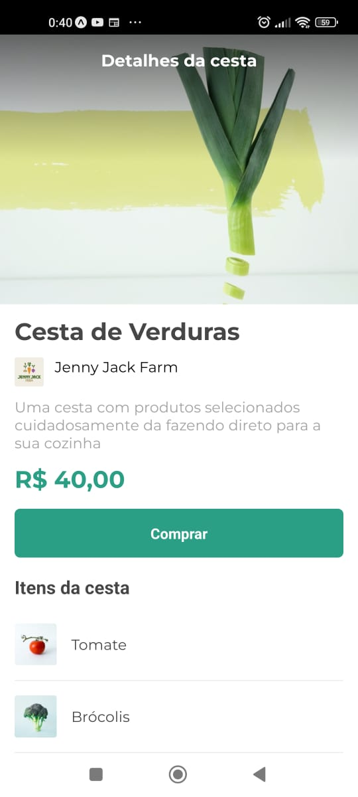
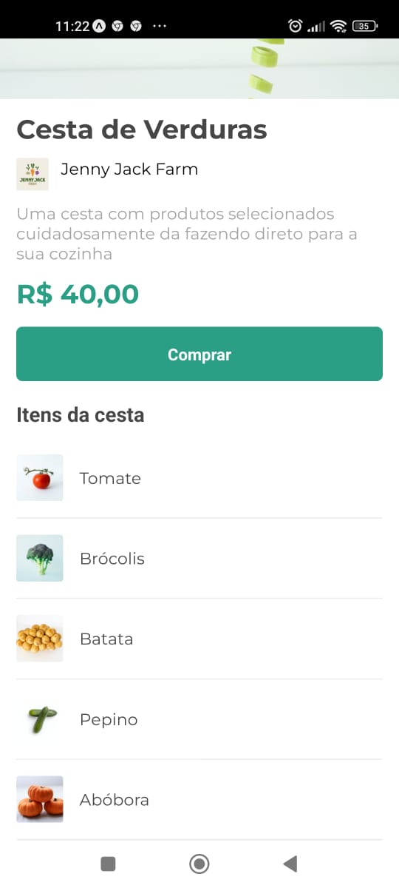

<h1 align="center">
    <a href="https://pt-br.reactjs.org/"> Orgs Cesta</a>
</h1>

🚀 Formação React Native Alura: App 01 - Cesta de compras

<h1 align="center">
  
  
</h1>

### Componentes e Recursos

- [x] Text
- [x] View
- [x] SafeAreaView
- [x] FlatList
- [x] TouchableOpacity
- [x] StatusBar
- [x] AppLoading
- [x] Fonts customizadas

### 🛠 Tecnologias

As seguintes ferramentas foram usadas na construção do projeto:

- [Expo](https://expo.io/)
- [Node.js](https://nodejs.org/en/)
- [React](https://pt-br.reactjs.org/)
- [React Native](https://reactnative.dev/)
